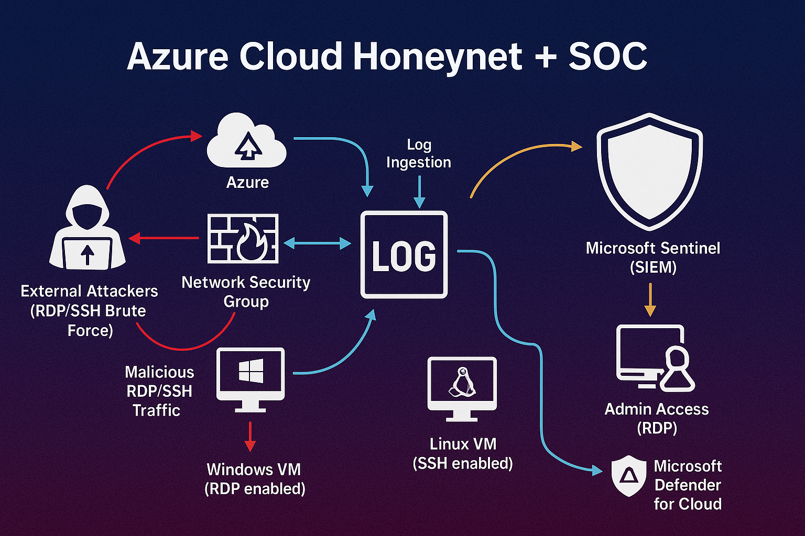

#  Azure Cloud Honeynet (SOC Homelab)
**Windows VM Honeypot - Simulating RDP-based Attacks and SIEM Analysis**

---

### Introduction
This project demonstrates how I built a Windows Virtual Machine Honeypot in Microsoft Azure to simulate real-world cyberattacks. My main goal of this project was to intentionally expose my Virtual Machine to the internet and observe attacker activity using Microsoft Sentinel and Log Analytics.

---

### 🎯 Objectives
The objective of this project was to build a Windows honeypot in Microsoft Azure to attract and observe real-world cyberattacks.I intentionally exposed the virtual machine’s RDP port to the internet to collect authentication attempts from external attackers.All security events were ingested into a Log Analytics Workspace and analyzed through Microsoft Sentinel using KQL queries.This allowed me to visualize global attack sources and understand common brute-force behaviors targeting cloud resources.
The project helped me strengthen my skills in Azure security monitoring, SIEM analysis, and threat detection using Sentinel.
---

###  Technologies & Azure Components:
* Azure Virtual Network (VNet)
* Azure Network Security Group (NSG)
* Virtual Machines ( Windows 11 )
* Log Analytics Workspace with Kusto Query Language (KQL) Queries
* Microsoft Sentinel for Security Information and Event Management (SIEM)
* Windows Remote Desktop for Remote Access
* Command Line Interface (CLI) for System Management

---

### ⚙️ Methodology

#### 1. Environment Setup
- Deployed a Windows Virtual Machine inside an Azure Virtual Network.  
- Configured the Network Security Group (NSG) to allow inbound RDP from any IP address (0.0.0.0/0).  
- Disabled default Windows Firewall settings to allow public access.  
- Left the VM exposed for 24 hours to attract real-world RDP brute-force attempts.  

#### 2. Log Collection & SIEM Configuration
- Created and connected a Log Analytics Workspace (LAW) to the VM.  
- Integrated Microsoft Sentinel with LAW to ingest Windows Security Events.  
- Enabled the Windows Security Events via AMA connector.  
- Used KQL queries to identify failed login attempts and their source IPs.  

#### 3. Attack Observation
- Monitored security logs for Event ID 4625 (failed logon).  
- Observed hundreds of authentication attempts from unique IP addresses worldwide.  
- Imported a GeoIP watchlist into Sentinel to enrich attack data with country information.  
- Visualized global attack sources through an Attack Map workbook.

---

### 🌍 Attack Visualizations

#### Attack Map 

* Figure : Attack Map (Sentinel Workbook) showing RDP brute-force attempts targeting the Windows honeypot during the 24-hour observation period.*

## 📊 Observed Metrics (24-hour window)
| Total Windows Security Events - 21,182 
| Failed RDP Authentication Attempts (EventID 4625) - 4,877 
| Sentinel Incidents (auto-generated) - 343 
| Unique Source IPs - 150+ 

---

